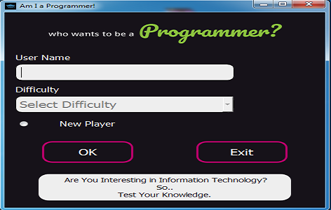

# Travia Game

Travia Game :GUI Application with PyQt5
exmine your knowledg in IT . based on repo for (Python semplified): https://github.com/MariyaSha/TriviaGame, a big thank you for her.

- Trivia Questions Database:
  https://opentdb.com/

I Develop The main game to what you can see here , I add a log-in form, and I set 3 levels of difficulty.
I add database file to deal with users data.

        

            <h1>Log-in Form</h1>
            
        

        

            <h1>Question Form</h1>
            
        

        

            <h1>Losing Form</h1>
            
        

        

            <h1>Winner Form</h1>
            
        

    

This Game is ongoing work , I'm going to complet developing it ....
